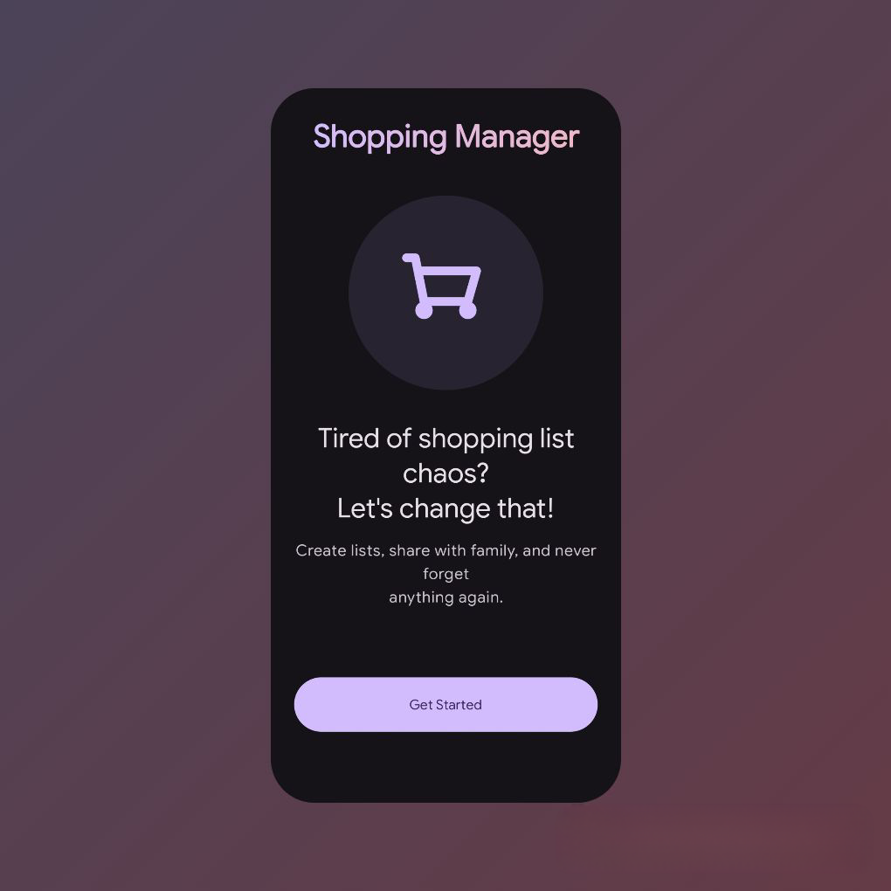
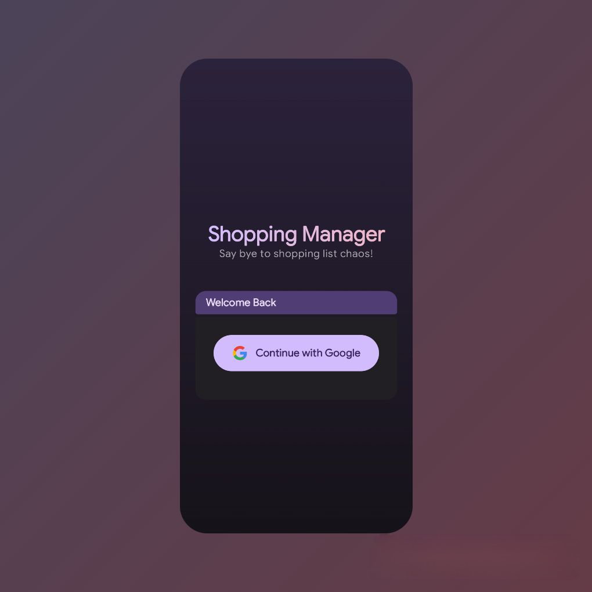
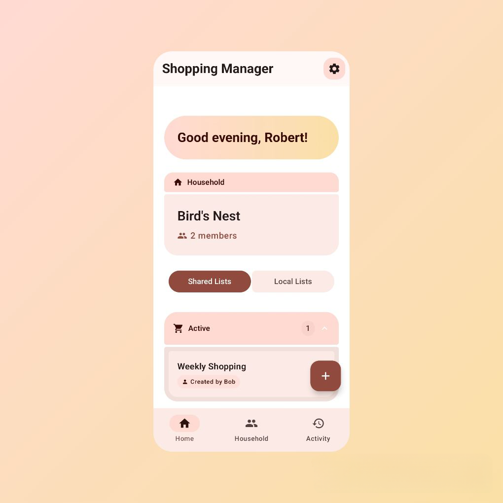
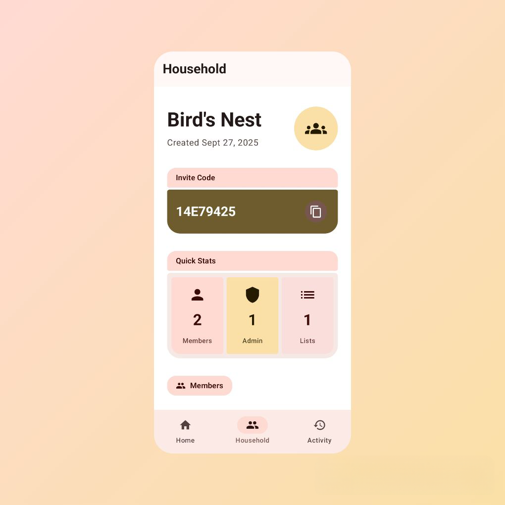
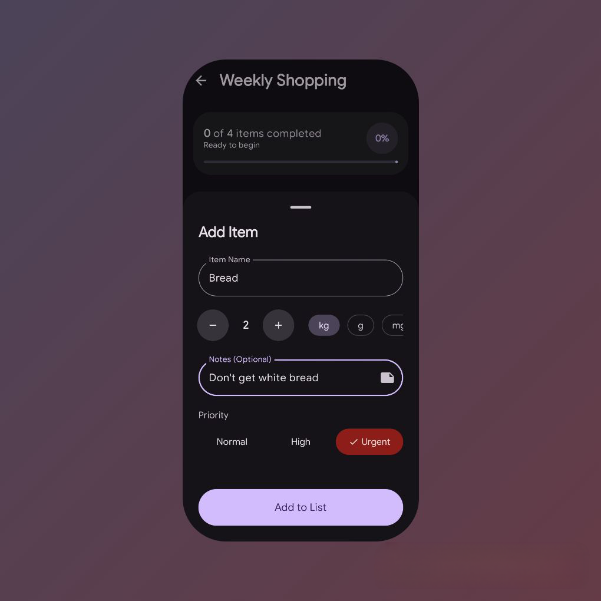
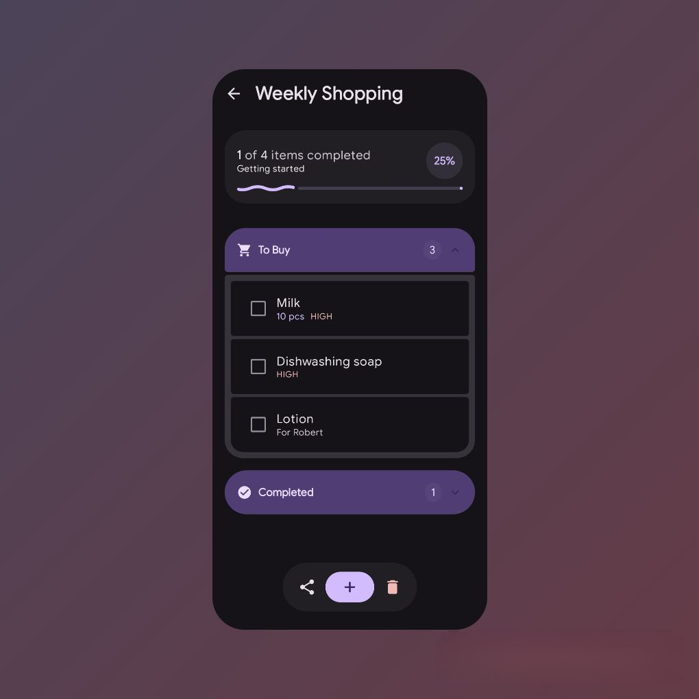
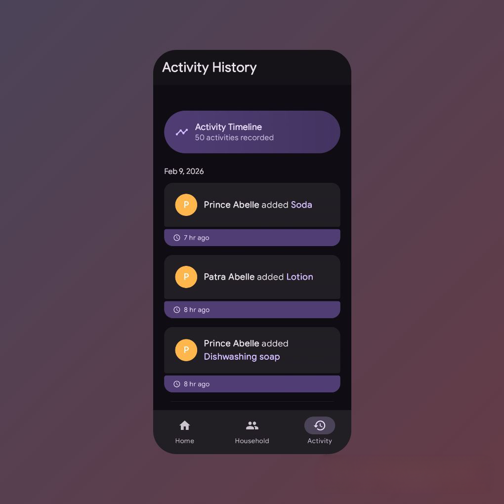
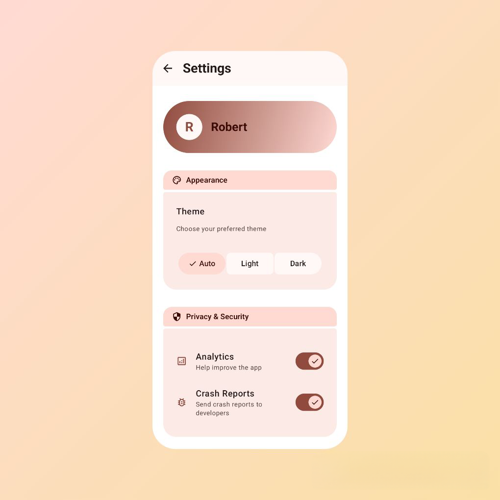

# Shopping Manager

## TL;DR(Summary)
This is a clean and simple **Shopping List Manager** for households.  
✔️ Share lists with family(or anyone, really)
✔️ Works offline in read-only mode
✔️ Enjoy a beautiful Material 3 Expressive UI
✔️ Lists are auto-archived when complete for a clean UI
✔️ Mark items as high priority or add notes to them
✔️ Local lists stored on-device for personal use

👉 [Download APK](https://github.com/Wazzicus/Shopping-Manager/releases/latest)

---

## 📖 Description
Shopping Manager is a **household shopping list app** built with a focus on simplicity, collaboration, and great design.  
Unlike messy notes apps, it is designed specifically for collaborative shopping and so it provides **shared lists** with features like priorities, notes, suggestions and much more.  

Key highlights:
- **Household support** – create or join a household and share shopping lists with everyone in it.  
- **Item priority levels** – mark items as Normal or High or Urgent.
- **Optional notes** – add context to your shopping items. 
- **Sign In securely with Google** for quick and easy access.   
- **Auto-archiving** – seperates old lists in the UI for a clean look
- **Create local lists** stored on-device for solo use. 
- **Modern UI** – built with Material 3 & Jetpack Compose.  

This app is backed by a **Supabase** backend, with additional support from **Firebase**.  

---

## ✨ Features
- **Household lists** – create and share shopping lists with family members.  
- **Notes & priority levels** for items.  
- **Offline mode** – read-only access when offline.  
- **Dark mode support** with a new Pitch black mode.
- **Support for personal, local lists** stored on-device.  
- **Auto-archiving** of completed lists.  
- **Google Sign-In** for quick and easy access.  
- **Beautiful Material 3 UI** with touches of Material 3 Expressive elements.  
- **Push notifications** (Work in Progress).  

---

## 📱 Screenshots

See the app in action:

  
  
  
  
  
  
  
  

---

## 📥 Download
👉 Get the latest APK here:  
[**⬇️ Download from Releases**](https://github.com/Wazzicus/Shopping-Manager/releases/latest)

---

## For the Nerds(My Stack):

**Frontend (Android)**  
- Kotlin, Jetpack Compose, Room, Retrofit, Hilt, Firebase  

**Backend**  
- Supabase 

**Other**  
- Firebase for messaging(push notifications) and authentication 

---

## Cons / Limitations  
- ❌ Requires internet for full functionality (offline mode is read-only).  
- ❌ Only Android is supported for now.  
- ❌ No price-tracking, items database or budgeting features as of now.
- ❌ Some features (e.g., conflict resolution on simultaneous edits, push notifications) are still being worked on.  

---

## 🚀 Roadmap
- [ ] Multi-platform support(iOS, Web) 
- [ ] Add home screen widgets
- [ ] Add barcode scanning for quick item entry  
- [ ] Create an item database 
- [ ] Add budgeting features and price tracking.

---

## 📜 License
This project is currently **proprietary**.  
You may **view** and [**download the APK**](https://github.com/Wazzicus/Shopping-Manager/releases/latest), but the source code is not open for reuse or modification at this time.

---

## 👤 Author
Developed with ❤️ by [**Emmanuel Abelle (Wazzicus)**](https://github.com/Wazzicus)  
